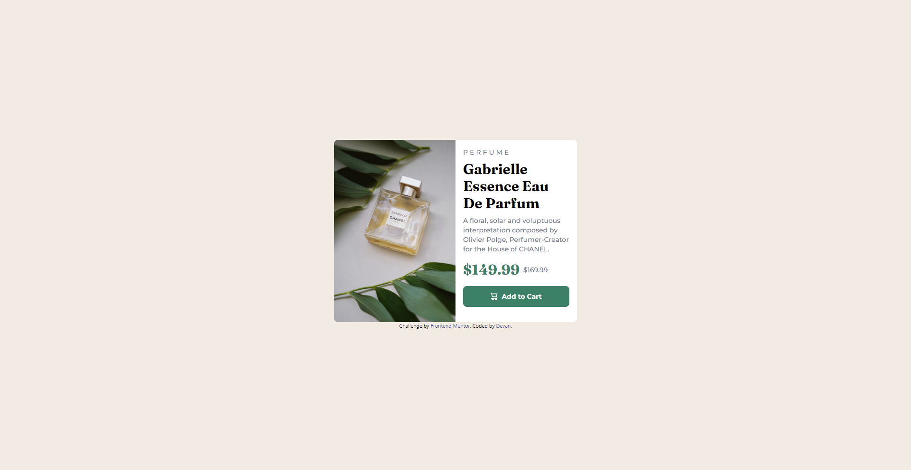

# Frontend Mentor - Product preview card component solution

This is a solution to the [Product preview card component challenge on Frontend Mentor](https://www.frontendmentor.io/challenges/product-preview-card-component-GO7UmttRfa).
## Table of contents

- [Overview](#overview)
  - [The challenge](#the-challenge)
  - [Screenshot](#screenshot)
  - [Links](#links)
- [My process](#my-process)
  - [Built with](#built-with)
  - [What I learned](#what-i-learned)
  - [Continued development](#continued-development)
  - [Useful resources](#useful-resources)

## Overview

### The challenge

Users should be able to:

- View the optimal layout depending on their device's screen size
- See hover and focus states for interactive elements

### Screenshot



### Links

- Solution URL: [Github](https://github.com/Nipaaaa1/product-preview-card)
- Live Site URL: [Github Pages](https://nipaaaa1.github.io/product-preview-card/)

## My process

### Built with

- HTML
- [Tailwind CSS](https://tailwindcss.com/) - CSS Framework

### What I learned

I learn about customizing in Tailwind CSS. This is very useful since I could customize almost any features in Tailwind CSS.

For example, I could add a new font like **Montserrat** or **Fraunces**:

```js
fontFamily: {
  'montserrat': ['Montserrat', 'sans-serif'],
  'fraunces': ['Fraunces', 'serif'],
},
```
or add another color to use in this project:
```js
colors: {
  darkcyan: '#3c8067',
  cream: '#f2ebe3',
  verydarkblue: '#1c232b',
  darkgrayishblue: '#6c7289',
  active: '	#214538',
},
```
Even override the default style of Tailwind CSS:
```js
letterSpacing: {
  widest: '.25rem',
}
```

### Continued development

I should learn about responsive images, flex box, and breakpoints for future projects. It's really crucial when building a responsive website (or even a component).

### Useful resources

- [HSL to HEX Converter](https://htmlcolors.com/hsl-to-hex) - This is a HSL to HEX converter that I used in this projects. Really helpful.
- [Tailwind CSS](https://tailwindcss.com) - You could find anything necessary to build a project with Tailwind CSS in it's docs.